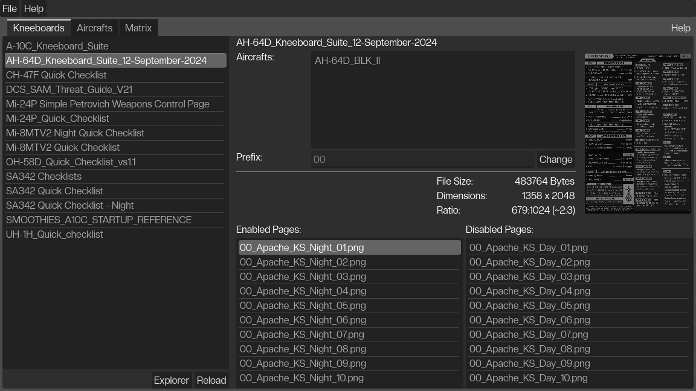
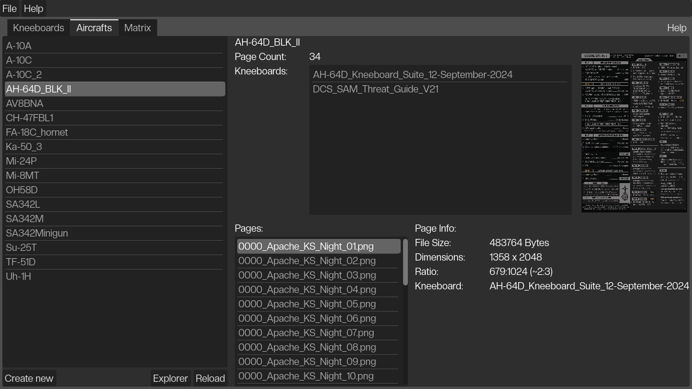
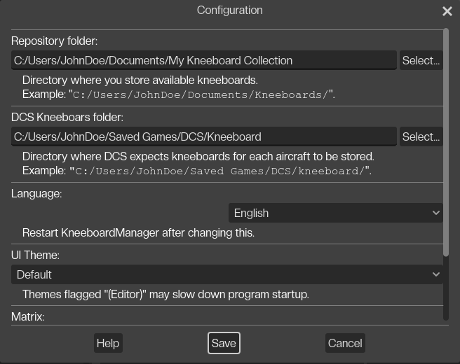

# Kneeboard Manager   for DCS

   

Latest Version: [0.0.4](//github.com/dantei-dev/Kneeboard-Manager-Releases/releases) (2025-02-08)  
Latest Highlights:
- Matrix: Aircraft labels stay always visible
- Several bugfixes, including config-related crashes
- "DCS Tweaks" tab, allows changing text size in VR and de-sanitizing Lua.

The *Kneeboard Manager* allows to easily manage and organize multiple kneeboards between multiple DCS aircrafts.
No more need to copy dozens of files manually into multiple directories.  
No more need to manually create directories for new aircrafts.  
No more mixed files from different kneeboards.  

You can manage the available kneeboards in the *Kneeboards* tab.  
You can manage available DCS aircrafts in the *Aircrafts* tab.  
You can assign kneeboards to aircrafts in the *Matrix* tab.  

Built-in documenation is available via *Menu > Help > Documentation...*.  

Download:
- Open the [`Releases`](//github.com/dantei-dev/Kneeboard-Manager-Releases/releases) page
- Download and run the latest `KneeboardManager.exe`
- No installation required

Features:
- Show preview thumbnails for kneeboards pages
- Show meta information (e.g. aspect ratio) for kneeboard pages
- Create aircraft folders (based on internal list of existing aircrafts)
- Convert JPG to PNG when copying kneeboards to aircrafts
- Built-in documentation
- Built-in image viewer
- "DCS Tweaks": Change message screen size for VR and/or desanitize Lua

For the change log, see the [releases](//github.com/dantei-dev/Kneeboard-Manager-Releases/releases/).

Screenshots:

   
  
    
